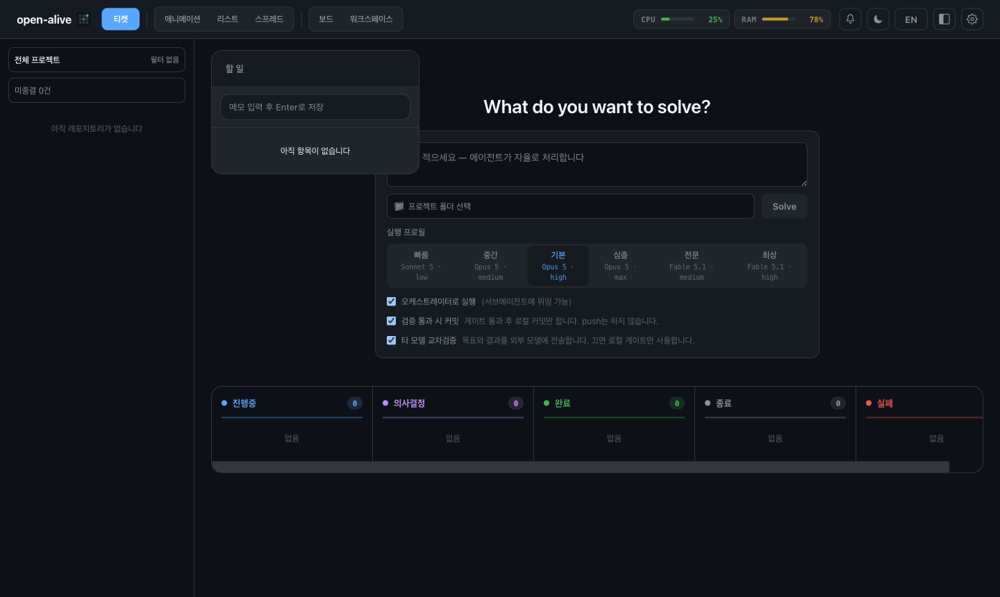

<p align="center">
  
</p>

<p align="center">
  <h1 align="center">open-alive</h1>
  <p align="center">
    A local, real-time dashboard and ticket runner for Claude Code sessions<br/>
    Claude Code 세션을 실시간으로 보고, 작업(티켓)을 맡기는 로컬 대시보드
  </p>
</p>

<p align="center">
  
</p>

<p align="center">
  <a href="#quick-start--빠른-시작">Quick Start</a> •
  <a href="#configuration--설정">Configuration</a> •
  <a href="#how-it-works--작동-원리">How It Works</a> •
  <a href="#features--주요-기능">Features</a> •
  <a href="#privacy--data--프라이버시와-데이터">Privacy</a> •
  <a href="#development--개발">Development</a>
</p>

---

## What is open-alive? / open-alive란?

**EN** — open-alive listens to [Claude Code hooks](https://docs.anthropic.com/en/docs/claude-code/hooks) and turns every session event (prompts, tool calls, sub-agents, permission requests) into a live dashboard: a pixel-art office where each agent is a character, an event stream, token usage, and an embedded terminal. On top of that you can hand it **tickets** — goals that it runs with the Claude Code CLI in a directory you choose, verifies, and reports back on.

Everything runs on your machine. There is no telemetry; the only outbound requests are the ones you configure (the Claude CLI itself, and an optional LLM gateway).

**KO** — open-alive는 [Claude Code 훅](https://docs.anthropic.com/en/docs/claude-code/hooks)으로 세션 이벤트(프롬프트, 도구 호출, 서브에이전트, 권한 요청)를 받아 실시간 대시보드로 보여줍니다. 에이전트가 캐릭터로 움직이는 픽셀 오피스, 이벤트 스트림, 토큰 사용량, 내장 터미널을 제공하고, 목표를 **티켓**으로 맡기면 지정한 디렉터리에서 Claude Code CLI로 실행·검증·보고합니다.

모든 것은 로컬에서 동작합니다. 텔레메트리는 없고, 나가는 요청은 사용자가 설정한 것(Claude CLI, 선택적 LLM 게이트웨이)뿐입니다.

---

## Quick Start / 빠른 시작

### Prerequisites / 필수 조건

| | Required | Notes |
|---|---|---|
| **Node.js ≥ 20** | yes | https://nodejs.org — an LTS release (20, 22 or 24) is recommended; newer releases may need C/C++ build tools for the native modules below |
| **Claude Code** | yes | https://docs.anthropic.com/en/docs/claude-code |
| **git** | yes | to clone the repo |
| pnpm ≥ 10 | from source | the installer enables it via `corepack` if missing |
| C/C++ build tools | sometimes | only if prebuilt `node-pty` / `better-sqlite3` binaries don't exist for your platform (macOS: `xcode-select --install`, Debian/Ubuntu: `build-essential python3`) |
| Python 3 | optional | only for the Efficio self-evaluation panel |

Supported: macOS, Linux, and Windows via WSL2 (install and run everything inside the WSL2 distro). Native Windows is **not supported**: the hook is a bash script, and the installer, terminal and Efficio assume a Unix environment. CI runs on macOS and Linux only.
지원: macOS, Linux, Windows는 WSL2에서만 (설치·실행 모두 WSL2 배포판 안에서). Windows 직접 설치는 **지원하지 않습니다** — 훅이 bash 스크립트이고 설치 스크립트·터미널·Efficio가 Unix 환경을 전제합니다. CI는 macOS·Linux에서만 실행됩니다.

### Option A — one-shot installer (recommended / 권장)

```bash
git clone https://github.com/must-goldenrod/open-alive.git
cd open-alive
./scripts/install.sh        # build → install the `open-alive` command → run setup
```

`install.sh` checks Node/pnpm, builds the self-contained package, installs the `open-alive` command globally with npm, then starts the **setup wizard**.
`install.sh`가 Node/pnpm 확인 → 빌드 → `open-alive` 명령 전역 설치 → **설정 마법사** 실행까지 한 번에 처리합니다.

### Option B — npm (planned / 예정)

Not published to the npm registry yet — use Option A for now.
아직 npm 레지스트리에 배포되지 않았습니다. 현재는 Option A를 사용하세요.

```bash
npm install -g open-alive   # after the first npm release / 첫 npm 릴리스 이후
open-alive setup
```

### The setup wizard / 설정 마법사

`open-alive setup` asks, in one pass / 한 번에 묻는 항목:

1. **Port** for the dashboard (default `3141`) / 대시보드 포트
2. **Register Claude Code hooks** in `~/.claude/settings.json` (a `.backup` copy is kept) / 훅 등록 (백업 유지)
3. **LLM gateway** *(optional)* — any OpenAI-compatible endpoint (LiteLLM, vLLM, Ollama `/v1`…). It lists the gateway's models and writes `~/.open-alive/models.json` / 선택: OpenAI 호환 게이트웨이 연결 및 모델 목록 생성
4. **Autostart at login** *(macOS, optional)* / 로그인 시 자동 시작
5. **Start now** / 바로 시작

Answers are saved to `~/.open-alive/.env` (mode `600`). Re-run `open-alive setup` any time to change them; `open-alive setup --yes` takes all defaults.
답변은 `~/.open-alive/.env`(권한 600)에 저장되고, 언제든 다시 실행해 바꿀 수 있습니다.

### Verify / 동작 확인

```bash
open-alive status          # → {"pid": …, "agents": [...], …}
claude                     # start any Claude Code session — a character appears in the dashboard
open-alive doctor          # which agent runtimes are installed
```

Open **http://localhost:3141** (or your port).

### Uninstall / 제거

```bash
open-alive stop
open-alive uninstall       # removes the hooks from ~/.claude/settings.json (and macOS autostart)
npm uninstall -g open-alive
rm -rf ~/.open-alive       # optional: all local data (events, tickets, tokens, settings)
rm -rf ~/.efficio          # optional: Efficio scores
```

---

## CLI

| Command | Description / 설명 |
|---|---|
| `open-alive setup` | Interactive setup (`--yes` defaults, `--no-start`) / 설정 마법사 |
| `open-alive install` / `uninstall` | Register / remove Claude Code hooks / 훅 등록·제거 |
| `open-alive start` / `stop` | Start (detached, opens the browser; `--no-open`, `--remote`, `--host`) / stop / 서버 시작·중지 |
| `open-alive status` | Server status as JSON / 서버 상태 |
| `open-alive logs` | Last 50 server log lines / 최근 로그 |
| `open-alive doctor` | Detect agent runtimes (`--json`) / 런타임 점검 |
| `open-alive token new\|list\|revoke` | Device tokens for remote access / 원격 접속 토큰 |
| `open-alive autostart enable\|disable\|status` | macOS launchd agent / macOS 자동 시작 |
| `open-alive version` | Installed version / 버전 |

---

## Configuration / 설정

All settings are optional and live in `~/.open-alive/.env` (`KEY=VALUE` per line). Values exported in the process environment win over the file. The full annotated list is in [`.env.example`](.env.example).
모든 설정은 선택이며 `~/.open-alive/.env`에 둡니다. 전체 목록은 [`.env.example`](.env.example) 참고.

| Variable | Default | Description |
|---|---|---|
| `OPEN_ALIVE_PORT` | `3141` | Dashboard / API port (the hook script reads it from the env file too) |
| `OPEN_ALIVE_AUTO_COMMIT` | `1` | After a ticket passes verification, commit its changes in the ticket's git repo. `0` disables |
| `OPEN_ALIVE_AUTO_COLLECT` | `1` | Run Efficio (`python3`) when a session ends. `0` disables |
| `OPEN_ALIVE_TICKET_CONCURRENCY` | built-in | Max tickets running at once |
| `LITELLM_BASE_URL` | `http://localhost:4000` | OpenAI-compatible gateway for sub-agent delegation and review panels |
| `LITELLM_KEY` | — | Gateway key. Without it, tickets run without delegation or panels |
| `OA_DELEGATE_MODEL` | from `models.json` | Default model for `oa-delegate` |
| `OA_DELEGATE_MODELS_FILE` | `~/.open-alive/models.json` | Model catalogue (`builtin` = the placeholder preset from `examples/models.example.json`; replace it with the ids your gateway serves) |
| `OA_PANEL_MODELS` | from `models.json` | Comma-separated review-panel roster |

### Model catalogue (`models.json`) / 모델 카탈로그

When a gateway is configured, the ticket orchestrator can delegate subtasks with `~/.open-alive/bin/oa-delegate`. Which models exist is up to **your** gateway, so the catalogue is a file you own — `open-alive setup` generates one from the gateway's `/v1/models`, and [`examples/models.example.json`](examples/models.example.json) shows every field:

```json
{
  "defaultModel": "fast-model",
  "panelModels": ["reasoning-model-a", "reasoning-model-b", "code-model"],
  "models": [
    { "id": "fast-model", "aliases": ["fast"], "kind": "fast", "note": "cheap bulk work", "fallbacks": ["reasoning-model-a"] }
  ]
}
```

A model that is rate-limited (HTTP 429) or retired falls back to the next one in its chain; the window is remembered in `~/.open-alive/delegate-cooldowns.json`.
한도 초과(429)나 폐기된 모델은 체인의 다음 모델로 넘어가고, 재개 시각을 기억해 다음 호출에서 건너뜁니다.

The wrapper is written on the first `open-alive start` and is not on your `PATH`; call it by its full path.
래퍼는 첫 `open-alive start` 때 생성되며 `PATH`에 없으므로 전체 경로로 호출합니다.

```bash
~/.open-alive/bin/oa-delegate --list-models                  # catalogue + cooldown state
~/.open-alive/bin/oa-delegate --model fast "<prompt>"        # alias or full id
~/.open-alive/bin/oa-delegate --model a,b "<prompt>"         # explicit chain
~/.open-alive/bin/oa-delegate --model a --no-fallback "…"    # pin one model (cross-checks)
```

---

## How It Works / 작동 원리

```
Claude Code session
  ↓ hook event (JSON on stdin)
~/.open-alive/hooks/stream-event.sh
  ↓ HTTP POST localhost:<port>/api/event
open-alive server (Node.js) ── SessionStore + FSM, SQLite event log, ticket runner
  ↓ WebSocket /ws
React UI (dashboard · pixel office · tickets · terminal)
```

1. **Hooks** — `open-alive install` copies `stream-event.sh` to `~/.open-alive/hooks/` and registers it for 17 lifecycle events. The script POSTs the event to the local server with a 2-second timeout and always exits 0, so it never blocks Claude Code.
   훅 스크립트는 2초 타임아웃으로 로컬 서버에 전달하고 항상 0으로 종료해 Claude Code를 막지 않습니다.
2. **Server** — receives events, tracks agents with a state machine, stores events in SQLite, runs tickets, and broadcasts over WebSocket. Binds `127.0.0.1` only unless remote mode is enabled.
3. **UI** — React app served by the same server.

```
spawning → listening → active → idle
                ↓         ↓
             waiting    error → active
                ↓
              done → despawning → removed
```

---

## Features / 주요 기능

- **Pixel office** — each agent is a character that walks, sits, types and shows the current tool in a speech bubble; sub-agents appear smaller; an org-chart overlay shows the hierarchy. / 에이전트를 캐릭터로 시각화, 조직도 오버레이
- **Dashboard** — projects sidebar, activity pulse, event stream, completion log, per-agent tool statistics (`GET /api/stats`). / 프로젝트별 그룹, 이벤트 스트림, 통계
- **Token usage** — parsed from Claude Code transcripts when a session ends (input / output / cache tokens, API calls, model). / 트랜스크립트 기반 토큰 집계
- **Embedded terminal** — multi-tab xterm.js over `node-pty`. / 내장 터미널
- **Tickets** — describe a goal and a working directory; open-alive runs Claude Code, verifies the result, asks you when a decision is needed, and (optionally) commits. Local or over SSH. / 목표를 티켓으로 맡기면 실행·검증·보고
- **Orchestration** *(needs a gateway)* — tickets can delegate subtasks to other models and get a multi-model review panel. / 게이트웨이 설정 시 서브에이전트 위임·멀티모델 리뷰
- **Prompt coach** — scores prompts you send and suggests improvements (local rules; LLM analysis is opt-in). / 프롬프트 품질 분석
- **Efficio** — zero-token, local self-evaluation of wasted effort per session (see [`efficio/README.md`](efficio/README.md)). / 세션 낭비 자기평가
- **Remote access** *(off by default)* — token-authenticated access from your phone or another machine. See below. / 원격 접속 (기본 꺼짐)
- **EN / KO UI**, light and dark themes. / 영어·한국어, 라이트·다크

---

## Privacy & data / 프라이버시와 데이터

open-alive only reads and writes on your machine / 로컬에서만 읽고 씁니다:

| Path | What |
|---|---|
| `~/.claude/settings.json` | hooks are added here (backup: `settings.json.backup`) |
| `~/.claude/projects/**` | read-only: Claude Code transcripts, for token usage and Efficio |
| `~/.open-alive/` | settings (`.env`, `models.json`), event DB, tickets, runs, logs, prompt data (`prompt/`) |
| `~/.efficio/efficio.db` | Efficio scores (contains session titles and project paths — don't share it) |

Prompt text sent to an LLM happens only when **you** configure a gateway (delegation, review panels) or opt in to prompt LLM analysis.
LLM으로 텍스트가 나가는 경우는 사용자가 게이트웨이를 설정하거나 프롬프트 LLM 분석에 동의했을 때뿐입니다.

> ⚠️ **Tickets run Claude Code non-interactively** in the directory you give them, with permission prompts bypassed, and may commit to that repository (`OPEN_ALIVE_AUTO_COMMIT=0` to disable). Only point tickets at directories you are comfortable letting an agent change.
> 티켓은 지정한 디렉터리에서 권한 확인 없이 Claude Code를 실행하고 커밋할 수 있습니다. 에이전트가 수정해도 되는 디렉터리만 지정하세요.

---

## Security / 보안

- Binds `127.0.0.1` by default; localhost-only CORS and WebSocket Origin allowlist. / 기본 loopback 전용
- Input validation with Zod, 1 MB body limit, security headers, 50 WebSocket clients max, path-traversal protection on static files.
- Hook scripts pass JSON via stdin (no shell interpolation).
- Vulnerability reports: see [SECURITY.md](SECURITY.md).

### Remote access / 원격 접속

Off by default. Turning it on replaces "a request from this machine is trusted" with an explicit bearer token plus an allowlist of routes a device may reach. A loopback address stops counting as authentication, because a tunnel (`ssh -L`, `cloudflared`) makes every remote request look local.
기본은 꺼져 있습니다. 켜면 bearer 토큰 + 허용 라우트 목록으로 인증하며, 터널을 거친 요청도 loopback으로 보이므로 loopback 주소는 더 이상 인증으로 취급하지 않습니다.

```bash
open-alive token new phone                                   # 1. token for the device (shown once)
echo 'OPEN_ALIVE_TICKET_ROOTS=/path/to/work' >> ~/.open-alive/.env   # 2. dirs a remote ticket may use (required)
open-alive stop && open-alive start --remote                 # 3. start with remote access
open-alive token revoke phone                                # later: revoke one device
```

| Variable | Meaning |
|---|---|
| `OPEN_ALIVE_REMOTE=1` | Opt in to remote access. Without it the server stays on loopback. |
| `OPEN_ALIVE_HOST` | Interface to bind. Defaults to `127.0.0.1`, or `0.0.0.0` in remote mode. |
| `OPEN_ALIVE_TOKENS` | `label:token` entries. Managed by `open-alive token`. |
| `OPEN_ALIVE_TICKET_ROOTS` | Colon-separated directories a ticket may run in. Required in remote mode. |
| `OPEN_ALIVE_REMOTE_SSH_HOSTS` | Hosts a remote device may target with an SSH ticket. Empty = none. |
| `OPEN_ALIVE_TRUST_LOOPBACK=1` | Keep trusting loopback in remote mode. Only safe when nothing proxies to the port. |
| `OPEN_ALIVE_REMOTE_TERMINAL` | `off` (default) / `watch` / `input` / `shell` |

| Terminal level | A device may | A stolen token means |
|---|---|---|
| `off` | tickets only | someone can queue work in the allowlisted directories |
| `watch` | read sessions, conversations, live pty output | your code and prompts are readable |
| `input` | type into an open pty | code execution on this machine |
| `shell` | start and kill ptys | a shell on this machine |

The server speaks HTTP, not HTTPS: put it on a private network such as [Tailscale](https://tailscale.com/) instead of forwarding a public port. A sleeping host answers nothing — that is expected.
서버는 HTTP만 제공합니다. 공인 포트포워딩 대신 Tailscale 같은 사설망을 권장합니다.

---

## Development / 개발

```bash
pnpm install
pnpm build                                        # all packages (Turborepo)
pnpm test                                         # vitest, all projects
pnpm --filter=@open-alive/ui exec tsc --noEmit    # UI type check
bash scripts/build-npm.sh                         # self-contained npm bundle → npm-dist/
```

Run from source without touching your real settings / 실제 설정을 건드리지 않고 실행:

```bash
HOME=$(mktemp -d) OPEN_ALIVE_PORT=3999 node packages/server/dist/index.js
pnpm --filter=@open-alive/ui dev    # Vite on :5173 with hot reload (proxies to :3141)
```

```
packages/
├── core/          shared types, agent FSM, session store, WS protocol, transcript parser
├── server/        HTTP + WebSocket server, ticket runner, orchestrator, PTY manager
├── storage/       SQLite event log and projections
├── hooks/         hook installer + stream-event.sh
├── cli/           `open-alive` command (setup, install, start, …)
├── i18n/          EN/KO translations
├── ui/            React 19 + Vite + Canvas 2D pixel office
└── prompt-*/      prompt capture, rules and analysis (runs inside the server)
efficio/           zero-token session self-evaluation (Python stdlib)
scripts/           install, build-npm, release, changelog
docs/adr/          architecture decision records (Korean)
```

Releases: `pnpm release:patch|minor|major` bumps the root `package.json`, regenerates the changelog, builds `npm-dist/`, tags, and publishes (`RELEASE_PUBLISH=0` skips the npm publish). The root `package.json` version is the single source of truth.

See [CONTRIBUTING.md](CONTRIBUTING.md) and [CODE_OF_CONDUCT.md](CODE_OF_CONDUCT.md).

---

## License / 라이선스

[MIT](LICENSE). Notification sounds are original and generated for this project; no third-party assets are bundled.

"Claude" and "Claude Code" are trademarks of Anthropic, PBC. open-alive is an independent community project and is not affiliated with or endorsed by Anthropic.
